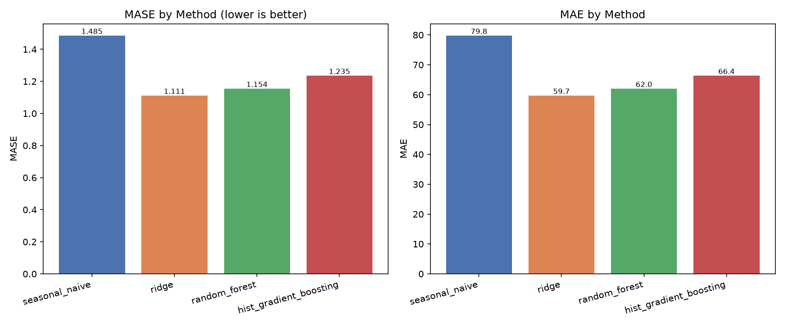
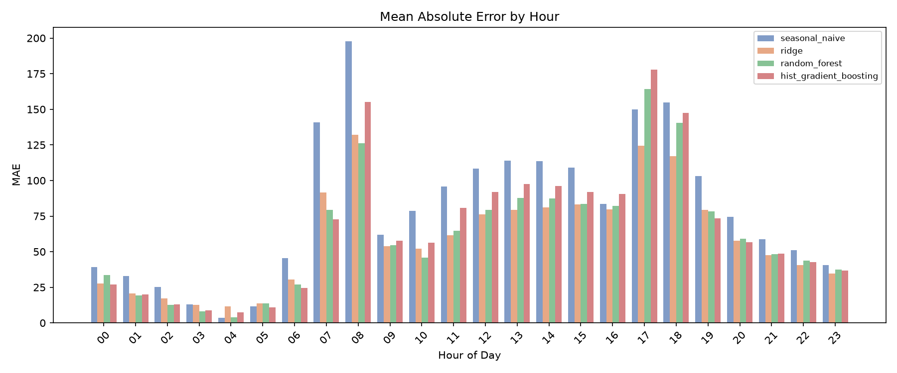
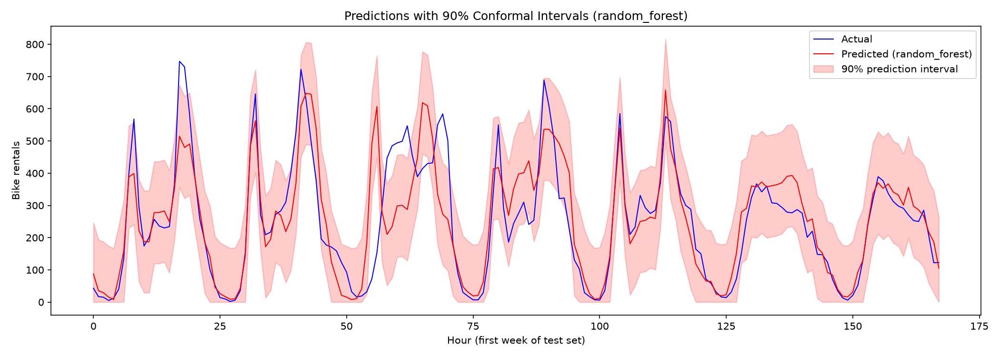

# Bike Demand Forecasting Report

**Mode:** FULL
**Run ID:** 20260717T023940Z
**Config hash:** 3c9f8ba664dd
**Source:** UCI Bike Sharing
**Start:** 2026-07-17T02:39:40.004751+00:00
**End:** 2026-07-17T02:40:12.696484+00:00
**Duration:** 32.7s
**Training samples:** 9991
**Calibration samples:** 2583
**Test samples:** 4257
**Features:** 19
**Seasonal scale (MASE):** 53.72
**Selected method:** random_forest (by calibration MASE)

---

## Executive Summary

Four forecasting methods were evaluated on UCI Bike Sharing data using a chronological train/calibration/test split. The best method by calibration MASE is **random_forest**.

Method ranking by calibration MASE (lower is better):
- random_forest: 1.1288
- hist_gradient_boosting: 1.1327
- ridge: 1.1761
- seasonal_naive: 1.5529

---

## Results (Test Set)

| Metric | seasonal_naive | ridge | random_forest | hist_gradient_boosting |
|---|---|---|---|---|
| **MASE** | 1.4852 | 1.1111 | 1.1543 | 1.2352 |
| **MAE** | 79.7839 | 59.6843 | 62.0085 | 66.3512 |
| **RMSE** | 133.2734 | 93.2630 | 97.9747 | 102.6507 |
| **SMAPE** | 41.93 | 39.27 | 32.30 | 41.49 |

### Prediction Intervals (90% split-conformal)

| Metric | seasonal_naive | ridge | random_forest | hist_gradient_boosting |
|---|---|---|---|---|
| **interval_coverage** | 90.9% | 89.5% | 89.2% | 88.3% |
| **mean_interval_width** | 395.07 | 262.21 | 281.70 | 285.25 |
| **winkler_score** | 615.67 | 431.94 | 459.38 | 473.71 |

**Coverage caveat:** The following methods fell below the 90% empirical coverage target: ridge, random_forest, hist_gradient_boosting. Chronological calibration and test residuals are not guaranteed to be exchangeable, so these intervals are experimental uncertainty estimates rather than coverage guarantees.

### Paired MASE Improvement vs Seasonal Naive

Day-block bootstrap 95% CI. Positive improvement means the alternative outperforms naive.

| Method | Mean improvement | 95% CI | Bootstrap probability of improvement |
|---|---|---|---|
| ridge | 0.3637 | [0.2390, 0.4892] | 100.0% |
| random_forest | 0.3238 | [0.2061, 0.4435] | 100.0% |
| hist_gradient_boosting | 0.2389 | [0.1055, 0.3739] | 100.0% |

---

## Dataset

The UCI Bike Sharing dataset (DOI 10.24432/C5W894, CC BY 4.0) contains 17,389 hourly records of bike rental demand in Washington, D.C. from 2011-2012.

---

## Methodology

### Methods
1. **Seasonal Naive** -- Predict using value from 24 hours earlier (strong baseline for hourly demand with daily seasonality).
2. **Ridge Regression** -- Linear model with L2 regularisation, trained on the same feature set.
3. **Random Forest** -- Ensemble of decision trees, trained on the same feature set.
4. **HistGradientBoosting** -- Gradient-boosted tree ensemble (scikit-learn), trained on the same feature set.

All predictions are clipped at zero.

### Conformal Prediction Intervals
Split-conformal prediction intervals (absolute residual quantile, finite-sample correction, method='higher', 90% target coverage).

### Temporal Validation
Chronological train/cal/test split at day boundaries. No random shuffle.

### Feature Leakage Prevention
- ``casual``, ``registered``, ``cnt`` excluded from features.
- Target-hour weather variables excluded.
- Data reindexed to complete hourly grid before time-based shifts.
- Rolling windows shifted by 24 hours.

---

## Error Analysis

Per-hour breakdown of forecast errors is available in
``tables/per_hour_metrics.csv``.

### Per-Hour Metrics for Selected Method (random_forest)

| Hour | Count | MAE | RMSE | MASE | Bias |
|---|---|---|---|---|---|
| 00:00 | 179 | 33.46 | 50.38 | 0.6229 | 11.68 |
| 01:00 | 177 | 19.37 | 27.30 | 0.3607 | 4.24 |
| 02:00 | 177 | 12.54 | 19.08 | 0.2334 | 4.86 |
| 03:00 | 166 | 8.29 | 12.32 | 0.1544 | 4.94 |
| 04:00 | 173 | 4.06 | 5.80 | 0.0756 | 2.60 |
| 05:00 | 177 | 13.69 | 17.85 | 0.2549 | 9.78 |
| 06:00 | 177 | 27.05 | 37.37 | 0.5035 | 10.51 |
| 07:00 | 177 | 79.22 | 108.60 | 1.4748 | 13.42 |
| 08:00 | 177 | 126.23 | 176.70 | 2.3499 | -50.96 |
| 09:00 | 177 | 54.54 | 74.41 | 1.0153 | -1.10 |
| 10:00 | 177 | 45.77 | 64.23 | 0.8520 | -5.18 |
| 11:00 | 177 | 64.87 | 89.58 | 1.2075 | -9.42 |
| 12:00 | 177 | 79.40 | 109.33 | 1.4781 | -20.71 |
| 13:00 | 179 | 87.76 | 121.69 | 1.6338 | -22.86 |
| 14:00 | 179 | 87.30 | 120.82 | 1.6252 | -18.83 |
| 15:00 | 179 | 83.63 | 112.98 | 1.5568 | -20.82 |
| 16:00 | 179 | 82.29 | 113.30 | 1.5320 | -18.93 |
| 17:00 | 179 | 164.35 | 196.53 | 3.0595 | -85.51 |
| 18:00 | 179 | 140.33 | 173.73 | 2.6124 | -55.19 |
| 19:00 | 179 | 78.26 | 102.32 | 1.4568 | 6.59 |
| 20:00 | 179 | 59.01 | 79.43 | 1.0985 | 3.52 |
| 21:00 | 179 | 48.39 | 65.60 | 0.9009 | 8.23 |
| 22:00 | 179 | 43.90 | 60.28 | 0.8171 | 14.38 |
| 23:00 | 179 | 37.55 | 49.08 | 0.6990 | 14.86 |

---

## Figures





---

## Conclusions

Test set results show a range of MASE values from ridge
(MASE 1.1111) to seasonal_naive (MASE 1.4852).

The calibration-selected method (random_forest) is not the lowest test MASE (ridge); calibration selection did not overfit to the test set.
For ridge, the paired day-block bootstrap MASE-improvement CI excludes zero ([0.2390, 0.4892]); 100.0% of bootstrap resamples had positive mean improvement.
For random_forest, the paired day-block bootstrap MASE-improvement CI excludes zero ([0.2061, 0.4435]); 100.0% of bootstrap resamples had positive mean improvement.
For hist_gradient_boosting, the paired day-block bootstrap MASE-improvement CI excludes zero ([0.1055, 0.3739]); 100.0% of bootstrap resamples had positive mean improvement.

**Important caveat:** These results are based on historical data from a single city (Washington, D.C., 2011-2012) and may not generalise to other locations or time periods.

---

## Limitations

1. **Limited dataset.** Two years from one city.
2. **No weather forecast integration.** Uses only lag and calendar features.
3. **Simple conformal method.** Assumes exchangeability of residuals.
4. **Offline evaluation.** Metrics on historical data only.

---

## Reproduction

```bash
uv sync --extra dev
uv run python scripts/download_data.py
uv run python scripts/reproduce.py  # full run
```

For smoke test:
```bash
uv run python scripts/reproduce.py --smoke
```

---

## License

Code: MIT. Data: UCI Bike Sharing (CC BY 4.0).
